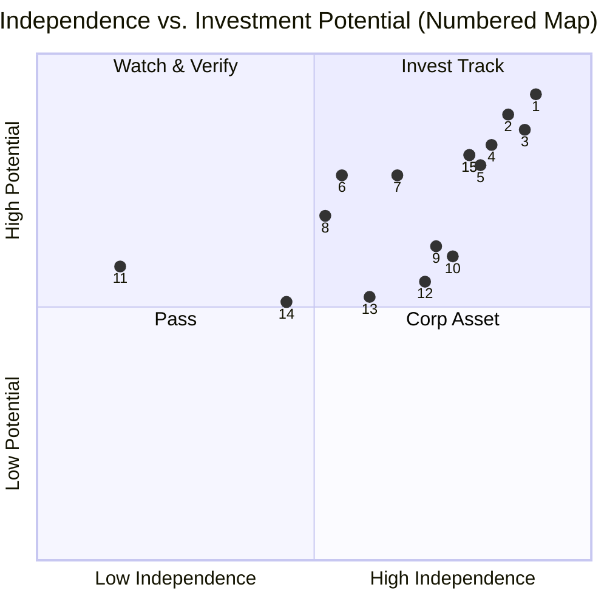

# OSS Investment Scorecard
### 开源项目投资评估框架 · AI周期专版

> **A structured, weighted scoring framework for USD-denominated VC funds evaluating open source projects during the AI technology acceleration cycle.**

Built from practice, not theory — calibrated against real deals including vLLM/Inferact ($150M @ $800M) and Hugging Face ($235M @ $4.5B).

---

---

**About the author:** [Lucy Chen](https://linkedin.com/in/lucycxy) is an EIR (Entrepreneur in Residence) at [Zoo Capital](https://zoocap.com), a Singapore-based VC fund with USD $2B+ AUM focused on open-source AI investing. She has 15+ years in product commercialization and capital strategy, with two prior startup exits. This framework was developed from direct evaluation work — not synthesized from secondary sources.

---

## 📢 V1.2 Update: From "Scoring Rubric" to "Diligence Protocol"

**March 2026 Update:** We have officially released **V1.2** of the framework. This update is a structural leap designed to eliminate bias when evaluating early-stage projects (Seed/Series A) where public data is often scarce.

**Key Improvements in V1.2:**
- **Mandatory Fact Sheet:** A 7-item pre-evaluation gate including competitive benchmarking.
- **Indirect Signal Inference:** Guidelines for using SOC2, billing complexity, and hiring signals to estimate traction when ARR is not public.
- **Project Age Calibration:** Prioritizing **Velocity** over absolute levels for projects <12 months old.
- **Narrative Pivot Exemptions:** Distinguishing market-following pivots from failure-driven ones.

👉 **[View V1.2 Full Framework (SKILL.md)](SKILL.md)** | **[View V1.2 Release Notes](https://github.com/el09xccxy-stack/oss-investment-scorecard/releases/tag/v1.2)**

---

## 📖 Framework Overview

| Dimension | Weight | What It Measures |
|-----------|--------|-----------------|
| **A. Open-Source Ecosystem Health** | 25% | Keyboard metrics: active contributors, PR velocity, production dependents, governance tier |
| **B. Team & Globalisation** | 20% | Engineering depth × GTM capability; US market access |
| **C. Technical Moat & Positioning** | 20% | L1-L4 technology ladder; narrative consistency; de facto standard potential |
| **D. Commercialisation & PMF** | 20% | Revenue quality hierarchy; PS vs ARR distinction; customer concentration |
| **E. Capital Exit Path** | 15% | M&A urgency; IPO readiness; comparable exits |

**Score Thresholds:**
- 🟢 **8.5–10.0** → Strongly Recommend
- 🟡 **7.0–8.4** → Recommend with Conditions
- 🟠 **5.5–6.9** → Watch / Track (re-evaluate in 6-9 months)
- 🔴 **< 5.5** → Pass

**One-Vote Vetoes:** 6 conditions that trigger automatic Pass regardless of total score. See [SKILL.md](SKILL.md) for full details.

---

---

---

## 🛡️ Optional Module: Star Health & Anti-Fraud Protocol

In the AI-cycle, GitHub stars have become a highly manipulable vanity metric. To ensure the integrity of **Dimension A (Ecosystem Health)**, analysts may optionally trigger the **Star Health Protocol** to detect "surface-level" popularity vs. real developer utility.

### When to use:
- Projects in hyper-hyped sectors (e.g., AI Agents, RAG wrappers).
- Projects with >20% MoM star growth but low issue activity.
- Pre-due diligence for Seed/Series A rounds.

### Core Health Metrics:
| Metric | Formula | Healthy Range | Risk Signal |
|:---|:---|:---|:---|
| **Star/Fork Ratio** | Stars ÷ Forks | 5x – 10x | >20x (Vanity/Bot risk) |
| **Star/Issue Ratio** | Stars ÷ Issues | 50x – 100x | >200x (Low engagement) |
| **Fork Rate** | Forks ÷ Stars | 9% – 23% | <5% (Low conversion) |
| **Watcher Rate** | Subscribers ÷ Stars | Baseline | Unpolluted signal |

> **Integration Note:** If the Star Health Protocol is active and returns "Weak" signals, the score for Dimension A should be penalized by **1.0 - 2.0 points**, regardless of absolute star count.

---
## ❓ Frequently Asked Questions

**Q: What metrics actually matter when evaluating an open source AI project for investment — beyond GitHub stars?**

Stars measure visibility, not investability. The framework weights four higher-signal metrics instead:
- **PR velocity** (commits per week, time-to-merge) — measures active development health
- **Production dependents** — how many real projects import this as a dependency
- **Contributor diversity** — single-maintainer projects fail at scale regardless of star count
- **Revenue quality** — ARR from enterprise contracts outweighs usage-based or donation income

A project with 2,000 stars and 40 production dependents is more investable than one with 40,000 stars and 3 dependents. LLaMA-Factory has 68K stars and scores borderline Pass on this framework.

---

**Q: What are the automatic disqualifiers — red flags that kill a deal regardless of total score?**

Six One-Vote Vetoes trigger an automatic Pass regardless of weighted score:

1. **Core IP not owned by the entity** — contributor IP not properly assigned
2. **License incompatibility** — copyleft obligations that block commercial use
3. **Single-maintainer bus factor with no succession plan**
4. **No path to US market access** — critical for USD-denominated exit
5. **Active litigation or unresolved patent claims** on foundational technology
6. **Fabricated benchmarks** — any evidence of manipulated performance claims

A project scoring 8.2/10 on dimensions still receives a Pass if any veto applies.

---

**Q: How does this framework handle projects where ARR or revenue isn't public?**

V1.2 introduced indirect signal inference for early-stage projects (Seed/Series A):

- **SOC2 Type II certification** → signals enterprise sales motion is underway
- **Billing complexity in public API docs** → indicates commercial tiers exist
- **Senior GTM/sales hires on LinkedIn** → revenue pursuit without disclosed numbers
- **Enterprise case studies on website** → production adoption even without ARR disclosure

"No public revenue data" ≠ "no revenue." The framework explicitly distinguishes these.

---

**Q: How do open source AI projects monetize — and which models are most investable?**

Revenue quality hierarchy (highest to lowest investability):

1. **ARR from enterprise contracts** — predictable, sticky, highest multiple
2. **Usage-based cloud revenue** — scales with adoption
3. **Dual-license commercial tier** — proven OSS model (HashiCorp, Elastic)
4. **Professional services / consulting** — doesn't scale, weak signal
5. **Donations / sponsorships only** — red flag, no commercial validation

Projects like Unsloth (8.10/10) score high despite no disclosed ARR because 150M+ downloads and YC backing signal imminent commercial traction.

---

**Q: What's the difference between a "Watch" verdict and a "Pass"?**

- **Watch (5.5–6.9):** Real signals exist but 1–2 critical elements are missing — usually PMF evidence or GTM capability. Re-evaluate in 6–9 months. These are pipeline entries, not rejections.
- **Pass (<5.5):** Fundamental structural issues — missing moat, no community traction, or a One-Vote Veto applies.

DeerFlow (6.15, Watch ⚠️Corp) is Watch because ByteDance backing structurally limits exit potential — but the technology is real. WFGY (5.80, Watch) is Watch because PMF is unproven, not because the technical thesis is wrong.

---

**Q: How does this compare to standard VC due diligence for SaaS or traditional software?**

Three gaps this framework fills that standard VC frameworks miss:

1. **Community health as a first-class signal** — 25% weight on ecosystem health reflects that open source distribution is the moat, not a feature.
2. **Corp flag discipline** — projects backed by Alibaba, ByteDance, or Ant Group are flagged (⚠️Corp) because corporate ownership structurally constrains exit optionality regardless of technology quality.
3. **Calibrated anchors** — every score is relative to vLLM (8.9/10, $800M valuation) and Hugging Face (8.35/10, $4.5B valuation). Without anchors, scores are opinions.

## 📁 Files

| File | Purpose |
|------|---------|
| [`SKILL.md`](SKILL.md) | **V1.2 Full scoring framework** — works with Claude, GPT-4, Gemini, OpenClaw, Manus, or any LLM agent |
| [`references/scored-examples.md`](references/scored-examples.md) | Calibration anchors: vLLM/Inferact (8.9/10) and Hugging Face (8.35/10) |
| [`template/evaluation-template.md`](template/evaluation-template.md) | Blank scorecard — fill in and submit |

---

## 🚀 How to Use

### Option A — Use with Claude AI
1. Download `oss-investment-scorecard.skill`
2. Go to Claude.ai → Settings → Skills → Upload
3. Ask Claude: *"Evaluate [project name] for open source VC investment"*
4. Claude will apply the full framework automatically

### Option B — Manual Evaluation
1. Open [`template/evaluation-template.md`](template/evaluation-template.md)
2. Fill in each dimension with your research
3. Calculate weighted score
4. Submit your evaluation (see below)

### Option C — Use with Any LLM Agent

Works with GPT-4, Gemini, OpenClaw, Cursor, Manus, or any agent that accepts a system prompt.

1. Open `SKILL.md` in this repository
2. Copy everything from line 17 onwards (skip the YAML header between the `---` markers at the top)
3. Paste into your agent's system prompt or context window
4. Ask: *"Evaluate [project name] for open source VC investment"*

---

## 📬 Submit Your Evaluation — Connect with Investors & Founders

**Why submit?**

This repository is maintained by [Lucy Chen](https://linkedin.com/in/lucycxy), EIR (Entrepreneur in Residence) at Zoo Capital, a Singapore-based VC fund with USD $2B+ AUM, focused on broad open-source project investing.

When you submit an evaluation, two things happen:

1. **Your evaluation becomes part of the public record** — other investors and founders can see which projects have been assessed
2. **You get optionally connected** — if you're an investor looking for deal flow, or a founder wanting investor feedback, Lucy can introduce relevant parties

**Who should submit:**
- 🔍 **Investors** who evaluated a project and want deal-sharing partners or co-investors
- 🏗️ **Founders** who want their project professionally scored and introduced to investors
- 📊 **Analysts** building open-source investment theses

### How to Submit

**[→ Submit via GitHub Issue](../../issues/new?template=submit-evaluation.md)**

Or reach Lucy directly:  
📧 **ossinvestor.2026@gmail.com**  
💼 LinkedIn: [linkedin.com/in/lucycxy](https://www.linkedin.com/in/lucycxy/)  
📘 Facebook: [facebook.com/lucy.chen.908347](https://www.facebook.com/lucy.chen.908347/)  
🌐 Fund: [zoocap.com](https://zoocap.com)

---

## 📊 Evaluated Projects (Community Submissions)

### Investment Scores Overview (Top Projects)

| Project | Score | Visual Representation (0-10) |
|:---|:---:|:---|
| **vLLM / Inferact** | **8.90** | `██████████████████░░` |
| **Hugging Face** | **8.50** | `█████████████████░░░` |
| **Unsloth** | **8.10** | `████████████████░░░░` |
| **LMCache** | **7.78** | `███████████████░░░░░` |
| **Hindsight** | **7.55** | `███████████████░░░░░` |
| **Infisical Agent Vault** | **7.50** | `███████████████░░░░░` |
| **DeepAgents** | **7.45** | `██████████████░░░░░░` |
| **AReaL** | **7.23** | `██████████████░░░░░░` |
| **AgentScope** | **6.73** | `█████████████░░░░░░░` |
| **TradingAgents** | **6.35** | `████████████░░░░░░░░` |
| **Hermes Agent** | **6.30** | `████████████░░░░░░░░` |
| **DeerFlow** | **6.15** | `████████████░░░░░░░░` |
| **WFGY** | **5.80** | `███████████░░░░░░░░░` |
| **MiroFish** | **5.54** | `███████████░░░░░░░░░` |
| **Aryn / Sycamore** | **5.13** | `██████████░░░░░░░░░░` |

### Potential vs. Independence Matrix

**Legend:**
1. vLLM | 2. HuggingFace | 3. Unsloth | 4. LMCache | 5. Hindsight | 6. DeepAgents | 7. AReaL | 8. AgentScope | 9. TradingAgents | 10. Hermes | 11. DeerFlow | 12. WFGY | 13. MiroFish | 14. Aryn/Sycamore | 15. Infisical Agent Vault | 15. Infisical Agent Vault

| Project | Score | Verdict | Batch | Submitted by | Date |
|---|---|---|---|---|---|
| [vLLM / Inferact](references/scored-examples.md) | 8.9/10 | 🟢 Strongly Recommend | Benchmark | @lucycxy | 2026-03 |
| [Hugging Face](references/scored-examples.md) | 8.5/10 | 🟢 Strongly Recommend | Benchmark | @lucycxy | 2026-03 |
| [unslothai/unsloth](https://github.com/el09xccxy-stack/agentvc-index/blob/main/cases/2026-03-23_unsloth.md) | 8.10/10 | 🟡 Yellow (Strong) | W13 | @lucycxy | 2026-03 |
| [LMCache/LMCache](https://github.com/el09xccxy-stack/agentvc-index/blob/main/cases/2026-03-08_lmcache.md) | 7.78/10 | 🟡 Yellow | W10 | @lucycxy | 2026-03 |
| [Infisical/agent-vault](https://github.com/lucy-cxy/agentvc-index/blob/main/cases/2026-04-25_agent-vault.md) | 7.50/10 | 🟡 Yellow | W17 | @lucycxy | 2026-04 |
| [Infisical/agent-vault](https://github.com/lucy-cxy/agentvc-index/blob/main/cases/2026-04-25_agent-vault.md) | 7.50/10 | 🟡 Yellow | W17 | @lucycxy | 2026-04 |
| [vectorize-io/hindsight](https://github.com/el09xccxy-stack/agentvc-index/blob/main/cases/2026-03-23_hindsight.md) | 7.55/10 | 🟡 Yellow | W13 | @lucycxy | 2026-03 |
| [langchain-ai/deepagents](https://github.com/el09xccxy-stack/agentvc-index/blob/main/cases/2026-03-23_deepagents.md) | 7.45/10 | 🟡 Yellow | W13 | @lucycxy | 2026-03 |
| [inclusionAI/AReaL](https://github.com/el09xccxy-stack/agentvc-index/blob/main/cases/2026-03-08_areal.md) | 7.23/10 | 🟡 Yellow | W10 | @lucycxy | 2026-03 |
| [agentscope-ai/agentscope](https://github.com/el09xccxy-stack/agentvc-index/blob/main/cases/2026-03-08_agentscope.md) | 6.73/10 | 🟠 Watch | W10 | @lucycxy | 2026-03 |
| [TauricResearch/TradingAgents](https://github.com/el09xccxy-stack/agentvc-index/blob/main/cases/2026-03-23_tradingagents.md) | 6.35/10 | 🟠 Watch | W13 | @lucycxy | 2026-03 |
| [NousResearch/hermes-agent](https://github.com/el09xccxy-stack/agentvc-index/blob/main/cases/2026-03-08_hermes-agent.md) | 6.30/10 | 🟠 Watch | W10 | @lucycxy | 2026-03 |
| [bytedance/deer-flow](https://github.com/el09xccxy-stack/agentvc-index/blob/main/cases/2026-03-08_deer-flow.md) | 6.15/10 | 🟠 Watch ⚠️ Corp | W10 | @lucycxy | 2026-03 |
| [WFGY](cases/) | 5.8/10 | 🟠 Watch | W10 | @onestardao | 2026-03 |
| [666ghj/MiroFish](https://github.com/el09xccxy-stack/agentvc-index/blob/main/cases/2026-03-23_mirofish.md) | 5.54/10 | 🟠 Watch | W13 | @lucycxy | 2026-03 |
| [Aryn / Sycamore](https://github.com/el09xccxy-stack/agentvc-index/blob/main/cases/aryn-sycamore-retrograde-W13.md) | 5.13/10 | 🔴 Pass | W13 v1.1 | @lucycxy | 2026-04 |
| *(your project here)* | | | | | |

*This table is updated as community submissions are reviewed. [Submit yours →](../../issues/new?template=submit-evaluation.md)*

---

## 🤝 Contributing

- **Improve the framework:** Open a PR with proposed changes to SKILL.md
- **Add a case study:** Submit a scored evaluation via Issue
- **Translate:** Chinese/English versions both welcome

---

## 📄 License

MIT — use freely, attribution appreciated.

---

*Maintained by Lucy Chen · [Zoo Capital](https://zoocap.com) · Last updated: April 2026 (v1.2 Roadmap)*

