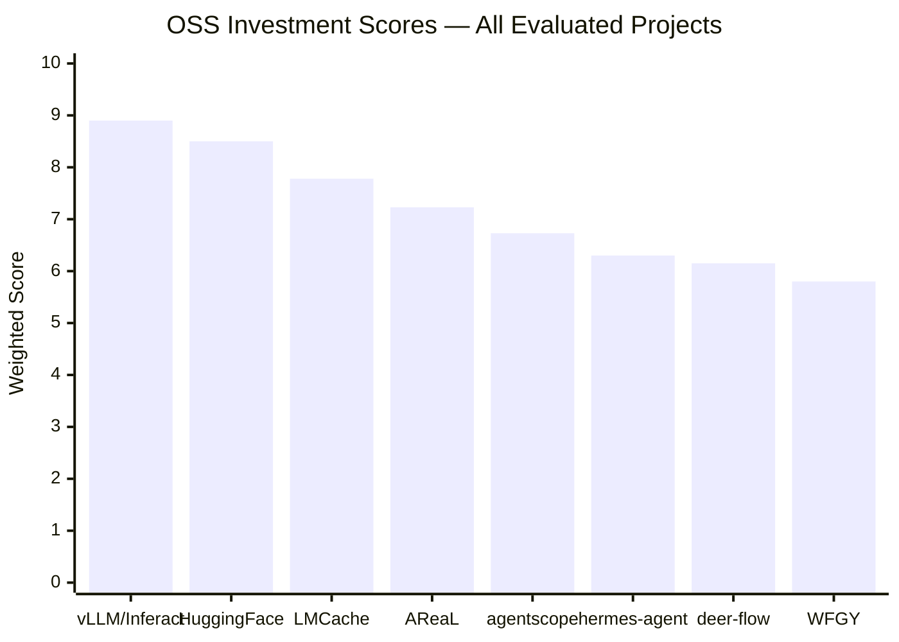
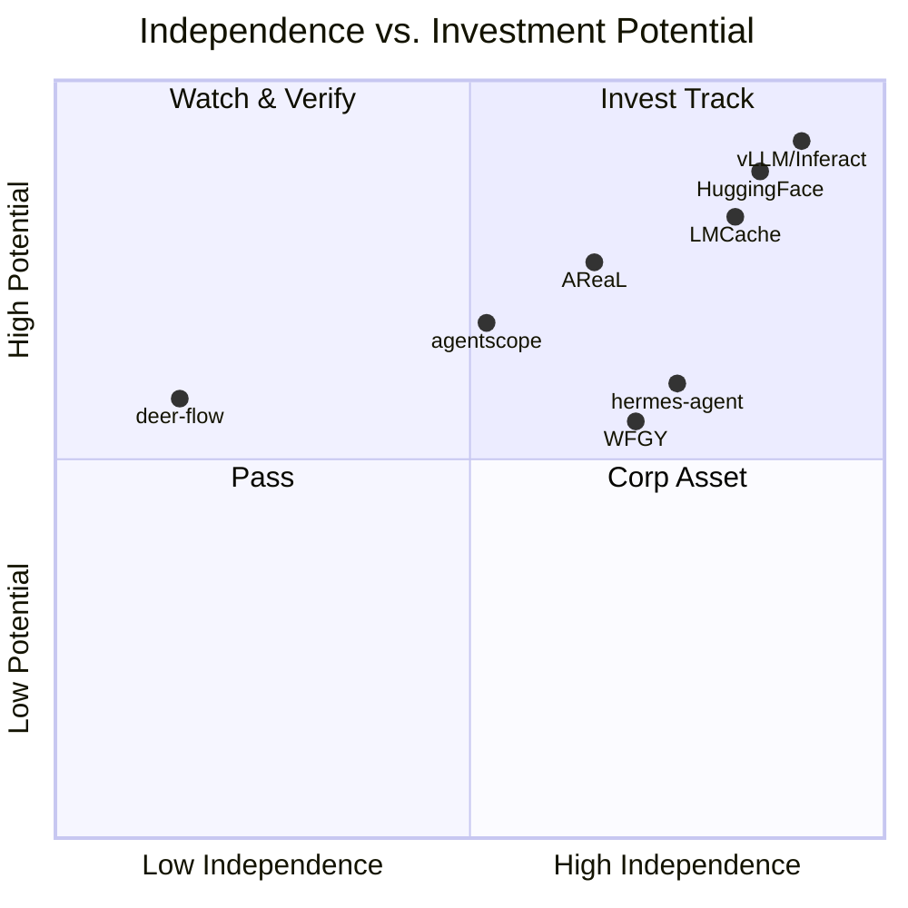

# OSS Investment Scorecard
### 开源项目投资评估框架 · AI周期专版

> **A structured, weighted scoring framework for USD-denominated VC funds evaluating open source projects during the AI technology acceleration cycle.**

Built from practice, not theory — calibrated against real deals including vLLM/Inferact ($150M @ $800M) and Hugging Face ($235M @ $4.5B).

---

## 📖 Framework Overview

| Dimension | Weight | What It Measures |
|-----------|--------|-----------------|
| **A. Open-Source Ecosystem Health** | 25% | Keyboard metrics: active contributors, PR velocity, production dependents, governance tier |
| **B. Team & Globalisation** | 20% | Engineering depth × GTM capability; US market access |
| **C. Technical Moat & Positioning** | 20% | L1-L4 technology ladder; narrative consistency; de facto standard potential |
| **D. Commercialisation & PMF** | 20% | Revenue quality hierarchy; PS vs ARR distinction; customer concentration |
| **E. Capital Exit Path** | 15% | M&A urgency; IPO readiness; comparable exits |

**Score Thresholds:**
- 🟢 **8.5–10.0** → Strongly Recommend
- 🟡 **7.0–8.4** → Recommend with Conditions
- 🟠 **5.5–6.9** → Watch / Track (re-evaluate in 6-9 months)
- 🔴 **< 5.5** → Pass

**One-Vote Vetoes:** 6 conditions that trigger automatic Pass regardless of total score. See [SKILL.md](SKILL.md) for full details.

---

## 📁 Files

| File | Purpose |
|------|---------|
| [`SKILL.md`](SKILL.md) | Full scoring framework — works with Claude, GPT-4, Gemini, OpenClaw, Manus, or any LLM agent |
| [`references/scored-examples.md`](references/scored-examples.md) | Calibration anchors: vLLM/Inferact (8.9/10) and Hugging Face (8.35/10) |
| [`template/evaluation-template.md`](template/evaluation-template.md) | Blank scorecard — fill in and submit |

---

## 🚀 How to Use

### Option A — Use with Claude AI
1. Download `oss-investment-scorecard.skill`
2. Go to Claude.ai → Settings → Skills → Upload
3. Ask Claude: *"Evaluate [project name] for open source VC investment"*
4. Claude will apply the full framework automatically

### Option B — Manual Evaluation
1. Open [`template/evaluation-template.md`](template/evaluation-template.md)
2. Fill in each dimension with your research
3. Calculate weighted score
4. Submit your evaluation (see below)

### Option C — Use with Any LLM Agent

Works with GPT-4, Gemini, OpenClaw, Cursor, Manus, or any agent that accepts a system prompt.

1. Open `SKILL.md` in this repository
2. Copy everything from line 17 onwards (skip the YAML header between the `---` markers at the top)
3. Paste into your agent's system prompt or context window
4. Ask: *"Evaluate [project name] for open source VC investment"*

---

## 📬 Submit Your Evaluation — Connect with Investors & Founders

**Why submit?**

This repository is maintained by [Lucy Chen](https://linkedin.com/in/lucycxy), EIR (Entrepreneur in Residence) at Zoo Capital, a Singapore-based VC fund with USD $2B+ AUM, focused on broad open-source project investing.

When you submit an evaluation, two things happen:

1. **Your evaluation becomes part of the public record** — other investors and founders can see which projects have been assessed
2. **You get optionally connected** — if you're an investor looking for deal flow, or a founder wanting investor feedback, Lucy can introduce relevant parties

**Who should submit:**
- 🔍 **Investors** who evaluated a project and want deal-sharing partners or co-investors
- 🏗️ **Founders** who want their project professionally scored and introduced to investors
- 📊 **Analysts** building open-source investment theses

### How to Submit

**[→ Submit via GitHub Issue](../../issues/new?template=submit-evaluation.md)**

Or reach Lucy directly:  
📧 **ossinvestor.2026@gmail.com**  
💼 LinkedIn: [linkedin.com/in/lucycxy](https://www.linkedin.com/in/lucycxy/)  
📘 Facebook: [facebook.com/lucy.chen.908347](https://www.facebook.com/lucy.chen.908347/)  
🌐 Fund: [zoocap.com](https://zoocap.com)

---

## 📊 Evaluated Projects (Community Submissions)





| Project | Score | Verdict | Submitted by | Date |
|---------|-------|---------|--------------|------|
| vLLM / Inferact | 8.9/10 | 🟢 Strongly Recommend | @lucycxy | 2026-03 |
| Hugging Face | 8.35/10 | 🟢 Strongly Recommend | @lucycxy | 2026-03 |
| [WFGY](https://github.com/el09xccxy-stack/oss-investment-scorecard/issues/1) | 5.8/10 | 🟠 Watch | @onestardao | 2026-03 |
| [LMCache/LMCache](https://github.com/el09xccxy-stack/agentvc-index/blob/main/cases/2026-03-08_lmcache.md) | 7.78/10 | 🟡 Yellow | @lucycxy | 2026-03 |
| [inclusionAI/AReaL](https://github.com/el09xccxy-stack/agentvc-index/blob/main/cases/2026-03-08_areal.md) | 7.23/10 | 🟡 Yellow | @lucycxy | 2026-03 |
| [agentscope-ai/agentscope](https://github.com/el09xccxy-stack/agentvc-index/blob/main/cases/2026-03-08_agentscope.md) | 6.73/10 | 🟠 Watch | @lucycxy | 2026-03 |
| [NousResearch/hermes-agent](https://github.com/el09xccxy-stack/agentvc-index/blob/main/cases/2026-03-08_hermes-agent.md) | 6.30/10 | 🟠 Watch | @lucycxy | 2026-03 |
| [bytedance/deer-flow](https://github.com/el09xccxy-stack/agentvc-index/blob/main/cases/2026-03-08_deer-flow.md) | 6.15/10 | 🟠 Watch ⚠️ Corp | @lucycxy | 2026-03 |


```
| *(your project here)* | | | | |

*This table is updated as community submissions are reviewed. [Submit yours →](../../issues/new?template=submit-evaluation.md)*

---

## 🤝 Contributing

- **Improve the framework:** Open a PR with proposed changes to SKILL.md
- **Add a case study:** Submit a scored evaluation via Issue
- **Translate:** Chinese/English versions both welcome

---

## 📄 License

MIT — use freely, attribution appreciated.

---

*Maintained by Lucy Chen · [Zoo Capital](https://zoocap.com) · Last updated: March 2026*
